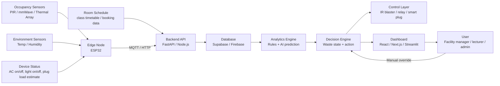
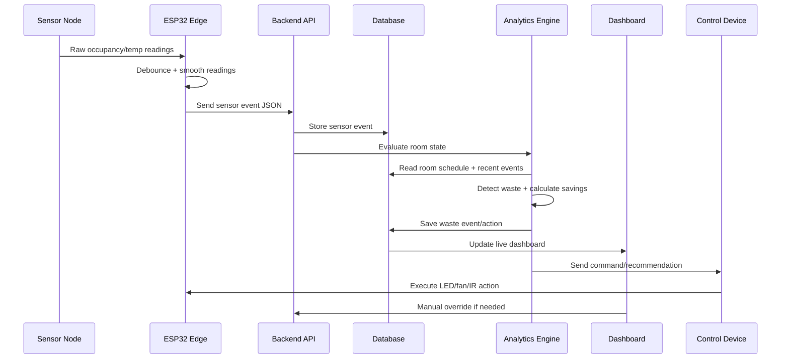

# EcoPulse System Architecture + Tech Stack

**Project:** EcoPulse — Privacy-Safe Retrofit Energy Optimization for Classrooms and Offices  
**Hackathon:** UM Technothon 2026  
**Primary target environment:** University classrooms, lecture halls, seminar rooms, meeting rooms, and small offices  
**Core promise:** Detect room-level energy waste in real time, recommend or trigger safe energy-saving actions, and show kWh/RM/CO₂ impact clearly.

---

## 1. Architecture Summary

EcoPulse is designed as a **retrofit smart energy management system**. It does not require full rewiring or a complete Building Management System (BMS). The system combines occupancy sensing, room schedule data, environmental sensing, device status, control logic, and impact tracking.

At preliminary stage, the architecture can be shown as a **simulation or clickable mock dashboard**. At finalist/prototype stage, the same architecture can be implemented with ESP32, sensors, a small fan/LED demo load, and a web dashboard.

### High-level architecture



---

## 2. What EcoPulse Actually Detects

EcoPulse should not claim perfect exact people counting. The practical version estimates **occupancy states**:

| State | Meaning | System action |
|---|---|---|
| Empty | No reliable presence detected | Turn off or recommend turning off AC/lights after delay |
| Low occupancy | 1–3 people or small occupied zone | Eco cooling / partial lighting / lower fan intensity |
| Medium occupancy | Normal room use | Maintain comfort mode |
| High occupancy | Dense room use | Maintain or increase cooling, avoid comfort complaints |
| Unknown/uncertain | Conflicting sensor signals | Do not auto-switch off; ask for confirmation or wait longer |

This is safer than promising exact headcount.

---

## 3. Layered System Architecture

## 3.1 Sensor Layer

### Required for prototype

| Sensor / input | Purpose | Why needed | Prototype priority |
|---|---|---|---|
| PIR sensor | Basic motion detection | Cheap and easy for demo | Must-have fallback |
| mmWave sensor | Detect still human presence | Better than PIR for seated students | Strongly recommended |
| Temperature/humidity sensor | Measures room condition | Supports comfort and cooling logic | Must-have |
| Manual switch/button | Override or simulate user control | Shows ethics and safety | Must-have |
| Simulated room schedule | Knows expected room usage | Detects post-class waste | Must-have |

### Optional upgrade

| Sensor | Purpose | Notes |
|---|---|---|
| Low-resolution thermal array | Privacy-safe heatmap and zone occupancy | Good for pitch/demo visuals, but not required for MVP |
| Current sensor | Estimate device load | Useful but can be unsafe if handling AC mains; use low-voltage demo only |
| Smart plug energy meter | Safer energy measurement for plug loads | Good if available |
| CO₂ sensor | Indirect occupancy / ventilation indicator | Too slow and costly for 3-day preliminary stage |

### Recommendation

For reliability:

```text
Use mmWave/PIR as the real occupancy signal.
Use thermal as a visual privacy-safe spatial layer only if available.
Do not depend on thermal alone for the whole pitch.
```

---

## 3.2 Edge Layer

### Role

The edge layer sits close to the room. It reads sensors, performs simple filtering, and sends clean events to the backend.

### Hardware

| Component | Function |
|---|---|
| ESP32 | Main microcontroller with Wi-Fi |
| PIR/mmWave sensor | Occupancy input |
| DHT22 / SHT31 / BME280 | Temperature and humidity input |
| IR LED/blaster | Simulate split AC remote control |
| Relay module / MOSFET module | Control LED/fan demo load |
| LEDs / mini fan | Demonstrate lighting and AC load |
| Push button | Manual override |
| OLED display, optional | Local room status display |

### Edge processing logic

```text
1. Read sensor values every 1–5 seconds.
2. Smooth noisy readings using moving average or debounce timer.
3. Convert raw values into events:
   - presence_detected
   - no_presence_for_X_minutes
   - temperature_high
   - manual_override_pressed
4. Send event payload to backend.
5. Receive command payload from backend.
6. Trigger LED/fan/IR command only if safe.
```

### Sample ESP32 payload

```json
{
  "room_id": "DK1",
  "timestamp": "2026-05-01T10:35:00+08:00",
  "presence": true,
  "occupancy_level": "low",
  "temperature_c": 27.8,
  "humidity_percent": 68,
  "light_status": "on",
  "ac_status": "on",
  "manual_override": false
}
```

---

## 3.3 Connectivity Layer

### Preferred finalist-stage protocol

| Option | Pros | Cons | Recommendation |
|---|---|---|---|
| MQTT | Lightweight, IoT-friendly, real-time | Slight setup overhead | Best for final prototype |
| HTTP POST | Simple and fast to implement | Less real-time | Best fallback |
| Firebase Realtime DB | Quick dashboard updates | Vendor lock-in; less IoT-native | Good for rapid demo |
| Supabase Realtime | SQL database + realtime | More setup than Firebase | Good if team knows SQL |

### Recommended approach

For preliminary mockup:

```text
Use simulated JSON data + dashboard animation.
```

For prototype:

```text
ESP32 → MQTT broker or HTTP API → backend/database → dashboard.
```

---

## 3.4 Backend Layer

### Main responsibilities

The backend receives room data, stores history, runs logic, and sends control decisions.

### Recommended backend stack

| Stack | Use case | Difficulty | Recommendation |
|---|---|---|---|
| FastAPI + Python | Good for AI/data logic | Medium | Best overall |
| Node.js + Express | Good for web team | Medium | Good if software team prefers JS |
| Firebase only | Fastest no-backend path | Low | Good fallback |
| Supabase Edge Functions | Good for integrated backend | Medium | Good if using Supabase |

### Recommended choice

```text
FastAPI + Supabase
```

Why:

- Python is convenient for AI/data logic.
- FastAPI is clean for API endpoints.
- Supabase gives PostgreSQL, auth, storage, and realtime-friendly data.
- React/Next.js can read from Supabase easily.

### Core API endpoints

| Endpoint | Method | Purpose |
|---|---|---|
| `/api/sensor-event` | POST | Receive ESP32/simulated sensor data |
| `/api/room-status/:roomId` | GET | Get latest room status |
| `/api/control-decision` | POST | Return recommended action |
| `/api/override` | POST | User manual override |
| `/api/savings-summary/:roomId` | GET | Return kWh/RM/CO₂ summary |
| `/api/demo/reset` | POST | Reset scenario for demo recording |

---

## 3.5 Database Layer

### Recommended database

```text
Supabase PostgreSQL
```

### Tables

#### `rooms`

| Field | Type | Example |
|---|---|---|
| room_id | text | DK1 |
| room_name | text | Lecture Hall DK1 |
| room_type | text | lecture_hall |
| capacity | integer | 80 |
| has_ac | boolean | true |
| has_lighting_control | boolean | true |
| baseline_ac_kw | decimal | 3.0 |
| baseline_lighting_kw | decimal | 0.5 |

#### `sensor_events`

| Field | Type | Example |
|---|---|---|
| event_id | uuid | auto |
| room_id | text | DK1 |
| timestamp | timestamptz | 2026-05-01 10:35 |
| presence | boolean | true |
| occupancy_level | text | low |
| temperature_c | decimal | 27.8 |
| humidity_percent | decimal | 68 |
| ac_status | text | on |
| light_status | text | on |

#### `room_schedule`

| Field | Type | Example |
|---|---|---|
| schedule_id | uuid | auto |
| room_id | text | DK1 |
| start_time | timestamptz | 2026-05-01 09:00 |
| end_time | timestamptz | 2026-05-01 10:00 |
| expected_occupancy | integer | 60 |
| event_name | text | Software Engineering Lecture |

#### `waste_events`

| Field | Type | Example |
|---|---|---|
| waste_id | uuid | auto |
| room_id | text | DK1 |
| start_time | timestamptz | 2026-05-01 10:05 |
| end_time | timestamptz | 2026-05-01 10:35 |
| waste_type | text | empty_room_ac |
| estimated_kwh | decimal | 1.5 |
| estimated_rm | decimal | 0.75 |
| estimated_co2_kg | decimal | 0.9 |
| action_taken | text | ac_off_recommended |

#### `control_actions`

| Field | Type | Example |
|---|---|---|
| action_id | uuid | auto |
| room_id | text | DK1 |
| timestamp | timestamptz | 2026-05-01 10:35 |
| action_type | text | set_ac_24c |
| action_mode | text | recommended / automated |
| status | text | pending / executed / overridden |
| reason | text | low occupancy detected |

---

## 3.6 AI / Analytics Layer

### Important principle

Do not overclaim “advanced AI controls the whole building”. The practical architecture is:

```text
Rule-based safety core + lightweight AI recommendations.
```

### AI components

| Component | What it does | Feasibility | Stage |
|---|---|---|---|
| Occupancy classification | Empty / low / medium / high | Easy-medium | Prototype |
| Waste event detection | Detect room empty + AC/lights on | Easy | Preliminary + prototype |
| Schedule mismatch detection | Class ended but energy still on | Easy | Preliminary + prototype |
| Savings estimation | kWh/RM/CO₂ calculation | Easy | Preliminary + prototype |
| Usage forecasting | Predict likely unused time slots | Medium | Finalist upgrade |
| Cooling recommendation | Recommend AC setpoint based on occupancy/temp | Medium | Finalist upgrade |
| Anomaly detection | Detect unusual energy behavior | Medium | Optional |

### Recommended AI design

#### MVP logic

```text
IF schedule_status = "inactive"
AND occupancy_level = "empty"
AND ac_status = "on"
AND empty_duration >= threshold_minutes
THEN waste_event = "empty_room_ac"
AND recommendation = "turn_off_ac"
```

#### Comfort logic

```text
IF occupancy_level = "low"
AND temperature_c <= comfort_upper_limit
THEN recommendation = "eco_mode_or_24c"

IF occupancy_level = "high"
AND temperature_c > comfort_upper_limit
THEN recommendation = "maintain_cooling"
```

#### Uncertainty logic

```text
IF sensor_confidence < threshold
THEN do_not_auto_shutdown
AND show "uncertain occupancy — waiting for confirmation"
```

### AI student deliverables

For preliminary:

- Define occupancy states.
- Create simple decision tree or scoring model.
- Create demo dataset with 3–5 scenarios.
- Create savings formula.
- Prepare explanation of why rule-based + AI is safer than black-box automation.

For finalist stage:

- Train lightweight classifier using collected sensor data.
- Add simple forecasting with historical room schedule and occupancy patterns.
- Add explainable recommendations.

---

## 3.7 Control Layer

### Control methods

| Method | Realism | Safety | Demo suitability |
|---|---:|---:|---:|
| LED strip control | Medium | High | Excellent |
| Mini fan control | Medium | High | Excellent |
| IR blaster AC command | High | High if not connected to mains | Excellent |
| Relay controlling mains AC | High | Low for students | Avoid |
| Smart plug control | Medium-high | Medium if rated properly | Optional |

### Recommended demo control

```text
Use LED + mini fan for visible action.
Use IR blaster animation/log to represent split AC control.
Do not wire into real AC mains.
```

### Safety rule

EcoPulse should include a manual override and fail-safe default:

```text
If sensor fails, network disconnects, or uncertainty is high:
- Do not aggressively shut off cooling.
- Keep comfort/safety mode.
- Notify user.
```

---

## 3.8 Dashboard Layer

### Recommended frontend stack

| Option | Pros | Cons | Recommendation |
|---|---|---|---|
| React + Vite | Fast and flexible | Need build UI manually | Good |
| Next.js | Polished, scalable | More structure | Best if team knows it |
| Streamlit | Very fast for data demo | Less product-like | Good fallback |
| Figma prototype | Fastest for preliminary | Not interactive with real data | Good for video mockup |

### Recommended preliminary approach

```text
Figma or React mock dashboard + animated simulated data.
```

### Recommended finalist approach

```text
React/Next.js dashboard connected to Supabase/FastAPI.
```

### Dashboard screens

| Screen | Purpose |
|---|---|
| Live Room Status | Shows occupancy, AC/light state, temperature, waste state |
| Heatmap / Zone Map | Shows privacy-safe spatial usage, not faces |
| Waste Event Timeline | Shows when waste happened and why |
| Savings Calculator | Shows estimated kWh, RM, and CO₂ reduction |
| Recommendations | Shows actions and reasoning |
| Admin Override | Lets user accept/reject automation |
| Campus View | Shows multiple rooms for scalability story |

### Example dashboard cards

```text
Room: DK1 Lecture Hall
Occupancy: Empty
Schedule: No active class
AC Status: ON
Waste Detected: Yes
Recommended Action: Turn off AC after 5-minute grace period
Estimated Wasted Energy: 1.5 kWh
Estimated Cost: RM 0.75
Estimated CO₂: 0.9 kg
Confidence: 87%
```

---

## 4. Full Data Flow



---

## 5. Recommended Tech Stack

## 5.1 Preliminary Stage Tech Stack

Since preliminary does not need a physical prototype, optimize for clarity and credibility.

| Area | Recommended tool | Output |
|---|---|---|
| Architecture diagram | Mermaid / draw.io / Figma | Clean system diagram |
| Dashboard mockup | Figma or React static page | Video-ready dashboard |
| Data simulation | Python / CSV / JSON | Room scenarios |
| AI logic demo | Python notebook or JS logic | Decision examples |
| Pitch slides | Canva / PowerPoint / Google Slides | Max 20 slides |
| Video | CapCut / Premiere / OBS | 8-minute unlisted YouTube video |

### Preliminary deliverable goal

```text
Show that EcoPulse is technically feasible even before the prototype stage.
```

---

## 5.2 Finalist Prototype Tech Stack

| Layer | Recommended stack | Backup stack |
|---|---|---|
| Microcontroller | ESP32 | Arduino Uno + Wi-Fi module, or Raspberry Pi |
| Occupancy | mmWave + PIR | PIR only + simulated occupancy |
| Thermal visual | AMG8833 / MLX90640, optional | Simulated heatmap |
| Temperature | DHT22 / SHT31 / BME280 | Manual input / simulated data |
| Connectivity | MQTT | HTTP POST |
| Backend | FastAPI | Node.js Express / Firebase only |
| Database | Supabase PostgreSQL | Firebase Realtime DB / local JSON |
| Frontend | React / Next.js | Streamlit |
| AI logic | Python rule engine + classifier | Rule engine only |
| Control | LED + mini fan + IR blaster | Dashboard-only control animation |
| Deployment | Local laptop + Wi-Fi hotspot | Fully simulated dashboard |

---

## 6. Minimum Viable Prototype Architecture

### Must-have

```text
1. Occupancy input: real PIR/mmWave OR simulated sensor stream.
2. Room schedule input: simple timetable table.
3. Waste detection: empty room + AC/lights on.
4. Control response: LED/fan off OR dashboard command log.
5. Savings estimate: kWh, RM, CO₂.
6. Dashboard: live status + reason for decision.
7. Manual override: avoid over-automation concern.
```

### Should-have

```text
1. Temperature/humidity input.
2. Occupancy level: empty / low / medium / high.
3. IR blaster AC command simulation.
4. Waste timeline.
5. Multi-room campus scalability view.
```

### Nice-to-have

```text
1. Real thermal heatmap.
2. ML classifier trained on collected data.
3. Forecasting next room usage.
4. Smart plug energy measurement.
5. Mobile notification.
```

### Cut immediately if time is short

```text
1. Exact people counting.
2. Seat-level accuracy.
3. Real AC mains control.
4. Reinforcement learning.
5. Carbon credit marketplace.
6. Full mobile app.
```

---

## 7. Control Logic Design

### Waste scoring model

```text
waste_score = 0

IF room_has_no_active_schedule:
    waste_score += 25

IF occupancy_level == "empty":
    waste_score += 35

IF ac_status == "on":
    waste_score += 25

IF light_status == "on":
    waste_score += 10

IF empty_duration_minutes >= 5:
    waste_score += 5

IF manual_override == true:
    waste_score = 0
```

### Decision mapping

| Waste score | Decision |
|---:|---|
| 0–29 | Normal |
| 30–59 | Monitor / notify |
| 60–79 | Recommend energy-saving action |
| 80–100 | Auto-action if automation enabled |

### Action examples

| Condition | Action |
|---|---|
| Empty + no schedule + AC on | Turn off AC or send IR off command |
| Empty + no schedule + lights on | Turn off lights |
| Low occupancy + room cool enough | Set AC to 24°C / eco mode |
| High occupancy + warm room | Maintain cooling |
| Sensor uncertainty | Wait and notify |
| Manual override | Suspend automation temporarily |

---

## 8. Impact Calculation Layer

### Core formulas

```text
Energy saved (kWh) = device_power_kW × avoided_runtime_hours

Cost saved (RM) = energy_saved_kWh × tariff_RM_per_kWh

CO₂ avoided (kg) = energy_saved_kWh × grid_emission_factor_kgCO2_per_kWh

Monthly saving = daily_saving × operating_days_per_month

Payback period (months) = hardware_cost_RM / monthly_saving_RM
```

### Important note for submission

All tariff values, emission factors, baseline AC power values, and claimed savings must be cited or clearly labelled as assumptions. Do not present simulated numbers as measured real-world results.

Use labels like:

```text
Verified fact: [source-backed]
Prototype assumption: [used for demo model]
Unknown: [requires site audit]
```

---

## 9. Privacy, Ethics, and Safety Architecture

### Privacy-by-design

| Risk | EcoPulse design response |
|---|---|
| Camera surveillance concern | Use thermal/mmWave/PIR instead of identifiable video |
| Individual tracking | Aggregate to room/zone level only |
| Personal data exposure | Store occupancy level, not identity |
| Over-monitoring | Show only facility-relevant data |
| Cloud privacy | Process basic occupancy locally where possible |

### Safety-by-design

| Risk | EcoPulse design response |
|---|---|
| False empty detection | Delay before shutdown |
| Comfort complaints | Manual override and grace period |
| Sensor failure | Fail-safe to normal mode |
| Unsafe wiring | Avoid real AC mains control in prototype |
| Network failure | Edge node keeps last safe state |
| Automation distrust | Explain reason for every action |

---

## 10. Role Ownership for Architecture

## Software Engineering Student 1 — Frontend / UX

Owns:

- Dashboard architecture
- Figma or React dashboard
- Live room status screen
- Savings visualization
- Multi-room scalability screen
- User journey and interface clarity

Deliverables:

- Dashboard mockup
- Slide visuals
- Demo flow screens
- Manual override UI

---

## Software Engineering Student 2 — Backend / Integration

Owns:

- API design
- Database schema
- Data flow diagram
- Simulated sensor JSON pipeline
- Integration plan between ESP32/backend/dashboard

Deliverables:

- API endpoint list
- Database tables
- Mock data generator
- Architecture diagram

---

## AI Student — Analytics / Decision Intelligence

Owns:

- Occupancy classification logic
- Waste scoring model
- Recommendation logic
- Impact calculation formulas
- AI explanation for judges

Deliverables:

- Decision tree / scoring model
- Sample scenarios
- Savings model
- “Why not black-box AI?” explanation

---

## Electrical Engineering Student — Hardware / IoT

Owns:

- Sensor selection
- ESP32 architecture
- Wiring plan
- Control layer plan
- Hardware bill of materials
- Prototype feasibility and safety

Deliverables:

- Sensor comparison table
- ESP32 data flow
- BOM
- Safety notes
- Finalist prototype plan

---

## Mechanical Engineering Student — HVAC / Energy Model

Owns:

- AC/cooling logic
- Room thermal assumptions
- Comfort constraints
- Energy savings model
- Retrofitting and installation story

Deliverables:

- HVAC control explanation
- Room layout diagram
- Cooling zone story
- Payback assumptions
- Facility-manager realism check

---

## 11. Preliminary Video Architecture Demo

Even without a physical prototype, the video can show architecture through a simulated scenario.

### Scenario

```text
A lecture ends at 10:00 AM.
At 10:15 AM, the room is empty, but AC and lights are still on.
EcoPulse detects no occupancy, checks room schedule, identifies waste, recommends AC/lights shutdown, and estimates savings.
```

### What to show visually

1. Mini architecture animation.
2. Room mockup with occupancy heatmap.
3. Dashboard status changing from “Normal” to “Waste Detected”.
4. Decision explanation: “No active class + no presence + AC on”.
5. Control action animation: AC/light off.
6. Savings calculator.
7. Facility manager view across multiple rooms.
8. Manual override button.

---

## 12. Backup Architecture

If hardware is not ready during finalist stage:

```text
Dashboard receives simulated sensor data from a Python script.
The Python script emits realistic room events every few seconds.
The control action is shown through dashboard animation.
The physical demo uses LEDs only.
```

If ML is not ready:

```text
Use rule-based decision engine and frame it as safety-first explainable AI.
```

If dashboard is not ready:

```text
Use Streamlit with simple charts and cards.
```

If sensor is noisy:

```text
Use confidence score, debounce logic, and manual override.
```

---

## 13. Final Recommended Architecture for Submission

### For preliminary pitch

```text
EcoPulse = Sensor fusion concept + AI decision engine + retrofit control + impact dashboard.
```

Do not overpromise exact headcount or real campus deployment.

### For finalist prototype

```text
ESP32 + PIR/mmWave + temp sensor → FastAPI/Supabase → React dashboard → LED/fan/IR demo control.
```

### Strongest technical claim

```text
EcoPulse does not merely monitor energy. It detects room-level waste events, explains why they happen, and triggers or recommends safe energy-saving actions with measurable impact.
```

---

## 14. Technical Architecture One-liner

**EcoPulse uses privacy-safe occupancy sensing, room schedule context, and an explainable decision engine to identify empty-room AC/lighting waste, trigger safe retrofit control actions, and quantify kWh, RM, and CO₂ savings through a real-time dashboard.**
