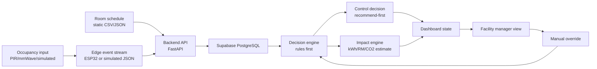
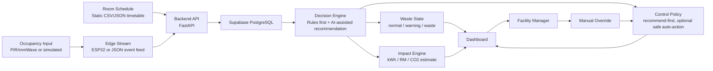

# EcoPulse - Product + Backend Day 1 Pack

This repository is for EcoPulse: a privacy-safe retrofit system that detects room-level energy waste in university classrooms and recommends safe AC/lighting actions with measurable kWh, RM, and CO2 impact.

## Day 1 outcome for Product + Backend Lead

By end of Day 1, lock:

1. Product scope statement
2. Architecture v1
3. Core module boundaries
4. Slide skeleton (product + backend storyline)

## 1) Product scope statement (locked)

**Working product name:** EcoPulse Lite

**Primary environment:** University classrooms (meeting rooms as later expansion)

**Core problem:** Shared rooms often leave AC/lights running after sessions end, creating avoidable energy waste with no room-level accountability.

**Core solution:** Occupancy-aware, schedule-aware waste detection with recommend-first control actions and optional safe auto-action.

**Preliminary-stage reality:** Demo is simulation-first (no unsafe real AC mains control claims).

### In-scope (preliminary)

- Room-level occupancy state (empty/low/medium/high)
- Schedule-aware waste detection
- Explainable decision logic (normal/warning/waste)
- Recommendation flow and manual override path
- Impact visibility (kWh, RM, CO2)

### Out-of-scope (preliminary)

- Exact people identification/counting claims
- Campus-wide live deployment claims
- Measured real savings claims without pilot
- Direct high-voltage AC mains switching

## 2) Final one-line pitch (Day 1)

EcoPulse is a privacy-safe retrofit system that detects empty-room AC and lighting waste in classrooms, recommends safe actions in real time, and shows estimated kWh, RM, and CO2 impact.

## 3) Target user and job-to-be-done

**Primary user:** Facility manager / classroom operations admin

**Job to be done:** "Help me detect and reduce avoidable room-level AC/lighting waste without sacrificing comfort or creating privacy concerns."

**Secondary users:** Lecturers and student room users (manual override and comfort feedback path)

## 4) Differentiation snapshot

| Option | What it does well | Limitation | EcoPulse difference |
|---|---|---|---|
| PIR-only motion setup | Low cost and simple | Misses still occupants | Adds schedule + device-state context |
| Smart plugs | Appliance-level control | Weak room context | Detects room-level waste events |
| Generic dashboards | Reporting visibility | Not action-oriented | Explainable detection + action recommendation |
| Full BMS | Powerful centralized control | Expensive, hard retrofit | Retrofit-first for older buildings |

## 5) Architecture v1 (rough diagram)



## 6) Module boundaries (Product + Backend ownership view)

| Module | Input | Output | Owner |
|---|---|---|---|
| Sensor event ingestion | Sensor/simulated room events | Normalized room event records | Backend |
| Schedule context | Timetable CSV/JSON | Active/inactive schedule status | Backend |
| Waste detection | Occupancy + schedule + AC/light status | normal/warning/waste state | Backend + AI |
| Control policy | Waste state + safety rules + override | recommend action / optional auto-action | Backend + Product policy |
| Impact calculator | Device power + avoided runtime + assumptions | estimated kWh/RM/CO2 | Backend + Mechanical |
| Dashboard feed | Latest room status + timeline + savings | cards/charts for UI | Backend + Frontend |

## 7) Backend contract v0 (Day 1 draft)

**Stack:** FastAPI + Supabase

### Endpoint skeleton

| Endpoint | Method | Purpose |
|---|---|---|
| `/api/sensor-event` | POST | Receive sensor/simulated room events |
| `/api/room-status/{roomId}` | GET | Return latest room state and decision |
| `/api/control-decision` | POST | Return recommended action from current context |
| `/api/override` | POST | Capture manual override and pause automation |
| `/api/savings-summary/{roomId}` | GET | Return estimated kWh/RM/CO2 summary |
| `/api/demo/reset` | POST | Reset scripted demo scenario |

### Core table skeleton

| Table | Purpose |
|---|---|
| `rooms` | Room metadata and baseline power assumptions |
| `room_schedule` | Static schedule windows used for context |
| `sensor_events` | Time-series room state observations |
| `waste_events` | Detected waste episodes and estimates |
| `control_actions` | Recommended/executed/overridden actions |

## 8) Slide skeleton for Product + Backend lead

1. Problem hook (empty room, AC still on)
2. User and pain (facility operations)
3. Why current solutions are insufficient
4. EcoPulse one-line value proposition
5. Architecture v1 (sensor -> backend -> decision -> dashboard)
6. Data and decision flow (what triggers waste flag)
7. Control policy (recommend-first, safe auto-action optional)
8. Dashboard logic (status, reason, action, impact)
9. Feasibility statement (what is simulated now vs built later)
10. Scalability statement (classrooms first, meeting rooms next)

## 9) Day 1 done criteria

Day 1 is complete when all items below are agreed by team:

1. Scope statement and non-claims finalized
2. Architecture v1 accepted by AI/electrical/mechanical teammates
3. Backend endpoint and table skeleton accepted for mock demo
4. Slide skeleton accepted for Day 2 asset production
---

## Day 2 - Pitch Assets and Technical Story (Implemented)

### 1) Final architecture slide content



**Slide headline:** From room signals to explainable energy action.

**Presenter line:** EcoPulse combines occupancy, schedule, and device state to detect avoidable waste events and produce safe, transparent actions.

### 2) Backend/data flow slide content

#### A. End-to-end flow (what happens)

1. Sensor or simulated event arrives (presence, occupancy level, AC/light status, room environment).
2. Backend attaches schedule context for the room and current time window.
3. Decision engine classifies room state as normal, warning, or waste.
4. Control policy outputs recommendation first (auto-action only if enabled and safe).
5. Impact engine logs estimated avoided runtime, kWh, RM, and CO2.
6. Dashboard updates cards, timeline, and reason trace for facility manager.

#### B. Event pipeline contract

| Stage | Input | Output |
|---|---|---|
| Ingestion | `sensor_event` | normalized event row |
| Contextualization | room + timetable | `schedule_status` attached |
| Decision | occupancy + schedule + device state | `waste_state` + reason |
| Action | waste state + policy + override | recommendation or safe action |
| Impact | power assumptions + avoided runtime | kWh/RM/CO2 estimate |

### 3) Backend/data model slide content

#### A. API contract (Day 2 locked for preliminary)

| Endpoint | Method | Main purpose |
|---|---|---|
| `/api/sensor-event` | POST | Receive room event stream (simulated or real) |
| `/api/room-status/{roomId}` | GET | Return latest room status, reason, and action |
| `/api/control-decision` | POST | Return decision output from current context |
| `/api/override` | POST | Record manual override and suspend automation |
| `/api/savings-summary/{roomId}` | GET | Return cumulative impact summary |
| `/api/demo/reset` | POST | Reset scenario for repeatable demo |

#### B. Data model contract (slide-ready)

| Table | Why it exists | Key fields to show on slide |
|---|---|---|
| `rooms` | Room metadata and baseline assumptions | room_id, room_type, baseline_ac_kw, baseline_lighting_kw |
| `room_schedule` | Expected room usage context | room_id, start_time, end_time, expected_occupancy |
| `sensor_events` | Time-series observations | room_id, timestamp, occupancy_level, ac_status, light_status |
| `waste_events` | Detected waste episodes | room_id, start_time, end_time, waste_type, estimated_kwh, estimated_rm, estimated_co2_kg |
| `control_actions` | Recommendations/executions/overrides | room_id, timestamp, action_type, action_mode, status, reason |

#### C. Demo payload examples (for team alignment)

```json
{
  "room_id": "DK1",
  "timestamp": "2026-05-01T10:15:00+08:00",
  "occupancy_level": "empty",
  "temperature_c": 27.8,
  "humidity_percent": 68,
  "ac_status": "on",
  "light_status": "on"
}
```

```json
{
  "room_id": "DK1",
  "waste_state": "waste",
  "recommendation": "turn_off_ac_and_lights_after_grace_period",
  "reason": "no_active_schedule + empty_occupancy + devices_on",
  "confidence": 0.87
}
```

### 4) Feasibility slide content

| Scope lane | What we show now (preliminary) | What we can build in finalist prototype | What needs validation later |
|---|---|---|---|
| Occupancy and context | Simulated occupancy + schedule feed | PIR/mmWave + schedule ingestion | Occupancy accuracy by room layout |
| Waste detection | Rule-based normal/warning/waste states | Live decision engine with event logging | Threshold tuning by real usage patterns |
| Control | Recommendation-first action cards | LED/fan/IR demo control with manual override | User acceptance and comfort outcomes |
| Impact model | Formula-based kWh/RM/CO2 estimates | Live cumulative impact dashboard | Site-calibrated baselines and tariff sensitivity |
| Deployment story | One-room deep-dive + multi-room preview | Multi-room ingest and campus view | Ops workflow and maintenance model |

**Feasibility message to judges:** We are not claiming measured savings yet; we are proving a buildable architecture with transparent assumptions and safety-first control logic.

### 5) Day 2 deliverables checklist (Product + Backend)

1. Final architecture slide content ready
2. Backend/data flow slide content ready
3. Backend/data model slide content ready
4. Feasibility slide content ready
5. Handoff contracts prepared for UX, AI, and Hardware leads

### 6) Cross-team handoff (Day 2)

| Team member | What they need from Product + Backend today |
|---|---|
| UX/Frontend lead | Room status fields, action/reason fields, savings fields for mock dashboard cards |
| AI lead | Occupancy and waste-state IO contract, reason format, confidence semantics |
| Hardware/IoT lead | Expected event payload fields and control action output contract |
| Mechanical lead | Impact formula inputs and comfort-policy constraints in decision logic |
